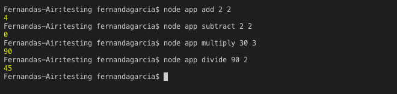
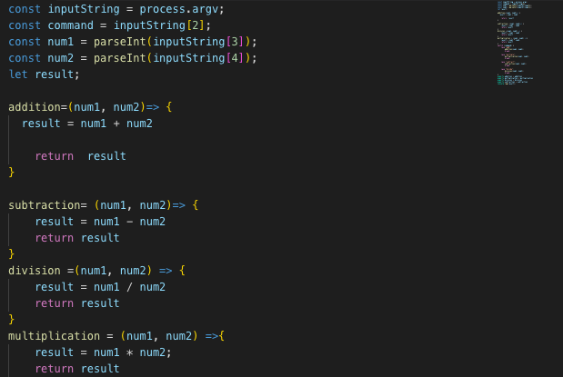
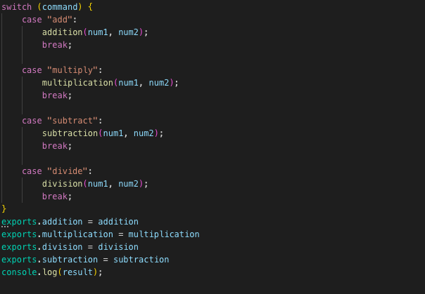
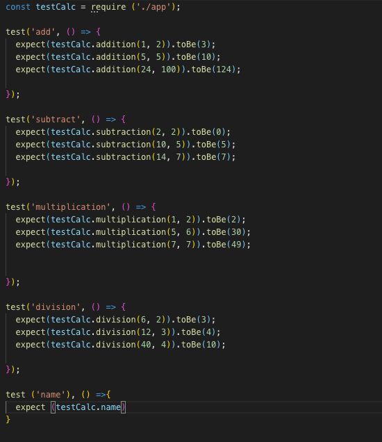
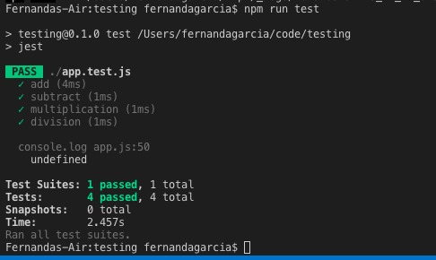

## Testing Basic Calculator Functions

### Summary:
An app that runs basic calculator commands and populates results in terminal. Jest was used as the testing library for this application. 

### Technologies:
  >Node,
  >Express,
  >JavaScript, &
  >Jest

### Examples: 

### Code for Calculator: 

### Code for Testing: 

### Test Results: 

